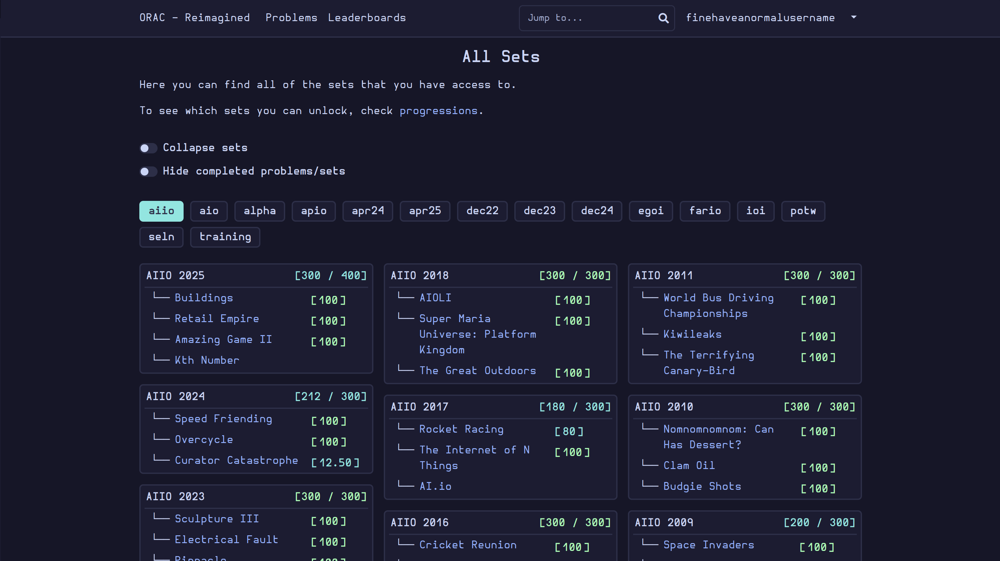
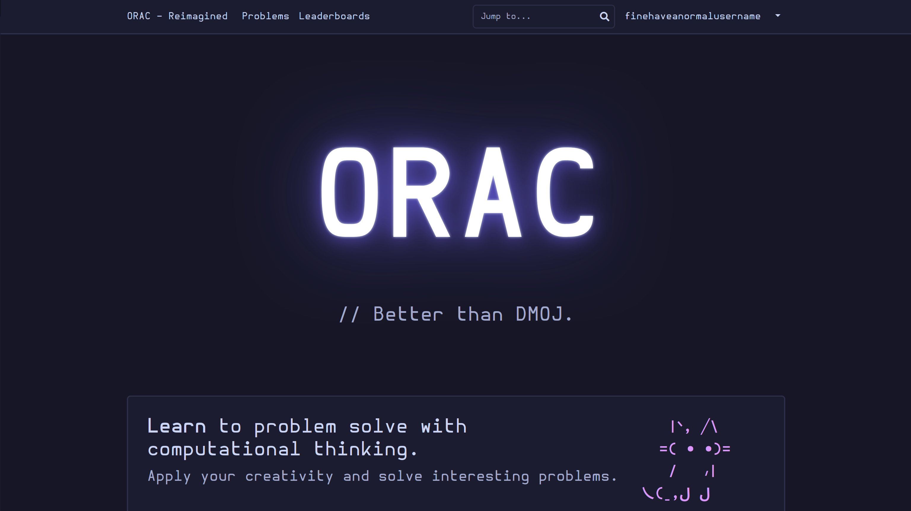
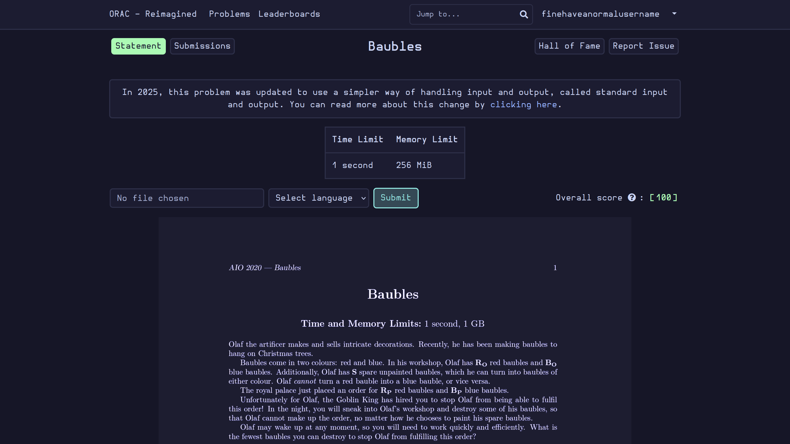
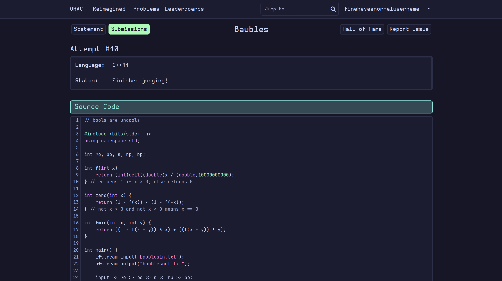
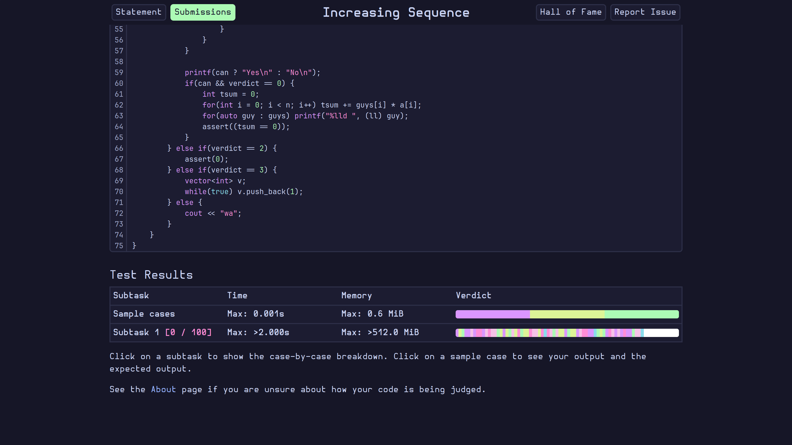

# ORAC - Re-imagined
This is a stylesheet for [ORAC](https://orac2.info), Australia's official informatics training site.
## How to use
1. Install the "Stylus" browser extension ([here](https://addons.mozilla.org/en-US/firefox/addon/styl-us/) for Firefox, [here](https://chromewebstore.google.com/detail/stylus/clngdbkpkpeebahjckkjfobafhncgmne?hl=en&pli=1) for Chrome).
2. Go to extension preferences or something, idk.
3. Import the `orac-reimagined.css file` from here.
*You could also paste it into `userContent.css` with the PDF tweak below; I think this method is easier though.
## How to get dark-mode PDFs (Firefox-only)
1. Find your Firefox profile folder (https://support.mozilla.org/en-US/kb/profiles-where-firefox-stores-user-data).
2. Go to the folder of whichever Firefox you use.
3. Go to (or create if you don't have it) the folder named `chrome`.
4. Import the `userContent.css` attached.
## Preview

